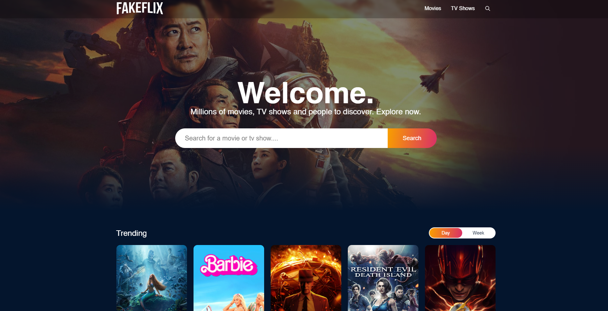

# Fakeflix Movie Project

A project where you can access all the information about movies.

## Demo

Live Demo Link: https://fakeflix-react-project.vercel.app

    

## Tools used

1. React: To create the App
2. React-Router: For Routing
3. Redux ToolKit: For State Management
4. React Lazy Load Image: To speed up the page loading time
5. TMDB API: As a Movie Database
6. Vite: For Instant Server Start
7. SCSS: For Everything Related to Design

## How to Use

To use the project follow the steps given below:

1. Install the necessary modules (`npm install`).
2. Use `npm run dev` to run the react app with Vite Server
